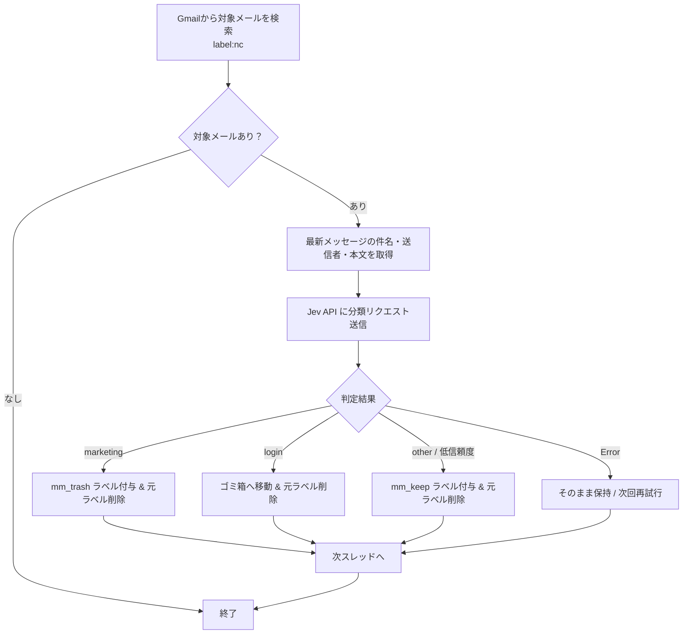

# Gmail Organizer with Jev (GAS)

Google Apps Script (GAS) 環境で動作し、Gmail のメール内容を Jev API で解析・自動分類してラベル付けや整理を行うスクリプトです。

---

## 概要

受信したメールや特定のラベルが付与されたメールを Jev API を用いて分類し、不要なプロモーションメールやログイン通知などを自動で振り分け・整理します。

### 主な特徴

- **AI による高精度な分類**: 件名・送信者・本文の一部（先頭1,000文字）をもとに、Jev API で内容を精査して分類。
- **自動ラベリング & 整理**:
  - `marketing`（セール・メルマガ・販促など）: 指定ラベル（例: `mm_trash`）を付与。
  - `login`（ログイン通知）: 自動でゴミ箱へ移動。
  - `other`（その他・重要連絡など）: 指定ラベル（例: `mm_keep`）を付与。
- **ラベルの自動生成**: 設定されたラベルが Gmail 上に存在しない場合、自動で新規作成。
- **バッチ処理**: 1回あたりの処理件数（スレッド数）を制限し、GAS の実行時間制限（6分）を超えないように段階的に実行可能。
- **安全設計**: API エラー時は元ラベルを保持し、次回実行時に再試行可能。

---

## 処理フロー



---

## 前提条件

- **Google アカウント**（Gmail および Google Apps Script が利用可能であること）
- **Jev API のアクセス情報**:
  - API エンドポイント URL
  - API キー (Bearer Token)

---

## セットアップ手順

### 1. Google Apps Script プロジェクトの作成

1. [Google Apps Script](https://script.google.com/) にアクセスし、「新しいプロジェクト」を作成します。
2. プロジェクト名を任意の名前に変更します（例: `Gmail Organizer with Jev`）。
3. エディタ内の `コード.gs` に、本リポジトリの [jev.gs](https://github.com/rami1942/gmail-jev-gas/blob/master/jev.gs) の内容をコピー＆ペーストします。

### 2. スクリプトプロパティの設定

Jev API の認証情報をスクリプトプロパティに登録します。コード内に直接ハードコードしないため、安全に運用できます。

1. GAS エディタ左メニューの **「プロジェクトの設定」**（歯車アイコン）をクリックします。
2. 画面下部の **「スクリプト プロパティ」** セクションで **「スクリプト プロパティを追加」** をクリックします。
3. 以下の2つのプロパティを設定して保存します：

| プロパティ名 | 設定値の例 | 説明 |
| :--- | :--- | :--- |
| `JEV_API_ENDPOINT` | `https://api.example.com/v1/classify` | Jev API のエンドポイント URL |
| `JEV_API_KEY` | `your_jev_api_key_here` | Jev API の API キー |

### 3. 初期設定（CONFIG の調整）

[jev.gs](https://github.com/rami1942/gmail-jev-gas/blob/master/jev.gs#L4-L10) 先頭の `CONFIG` オブジェクトで、対象とする検索クエリや付与するラベル名を環境に合わせて変更できます。

```javascript
const CONFIG = {
  SEARCH_QUERY: 'label:nc', // 振り分け対象を抽出する検索クエリ
  TARGET_LABEL: 'nc', // 処理後に削除する元ラベル
  LABEL_MARKETING: 'mm_trash', // マーケティングメールに付与するラベル
  LABEL_OTHER: 'mm_keep', // その他メールに付与するラベル
  BATCH_SIZE: 10 // 1回の実行で処理するスレッド上限数
};
```

> **推奨の運用例**:
> Gmail のフィルタ機能で、新着メールにあらかじめ `nc`（Not Classified などの意味）ラベルを自動付与しておき、本スクリプトで分類完了後に `nc` ラベルを外す運用がスムーズです。

### 4. 初回実行と権限の承認

1. エディタ上部の関数選択ドロップダウンで `organizeEmailsByJev` を選択します。
2. **「実行」** ボタンをクリックします。
3. 初回実行時、「承認が必要です」というダイアログが表示されます。画面の指示に従い、Gmail へのアクセスおよび外部サービスへの接続（UrlFetchApp）を許可してください。
4. ログ（「実行ログ」）を確認し、正常に判定・振り分けが行われているかテストします。

### 5. 定期実行トリガーの設定

自動で定期実行させる場合は、GAS のトリガーを設定します。

1. GAS エディタ左メニューの **「トリガー」**（時計アイコン）をクリックします。
2. 画面右下の **「トリガーを追加」** をクリックします。
3. 以下の内容で設定して保存します：
   - **実行する関数を選択**: `organizeEmailsByJev`
   - **イベントのソースを選択**: `時間主導型`
   - **時間ベースのトリガーのタイプを選択**: `分ベースのタイマー` または `時間ベースのタイマー`
   - **時間の間隔を選択**: `5分ごと`、`10分ごと`、`1時間ごと` など（メール受信頻度に合わせて設定）

---

## 分類ルールとカスタマイズ

[jev.gs](https://github.com/rami1942/gmail-jev-gas/blob/master/jev.gs#L74-L89) の `classifyEmailWithJev` 関数内で、Jev API へ渡すプロンプト・分類基準（`criteria`）を定義しています。分類項目を増やしたい場合はここを編集してください。

```javascript
"questions": {
  "category" : {
    "type": "choice",
    "instructions" : "Categorize this content.",
    "criteria" : {
      "marketing": "Sales, campaigns, promotions, newsletters, product information",
      "login": "Login notification",
      "other": "Other",
    }
  }
}
```

※ 新しいカテゴリを追加した場合は、[organizeEmailsByJev](https://github.com/rami1942/gmail-jev-gas/blob/master/jev.gs#L49-L69) 内の `switch (category)` に対応する処理（ラベル付与やアーカイブなど）を追加してください。

---

## 注意事項

- **API 利用制限・コスト**: Jev API の呼び出し回数やトークン消費量にご注意ください。大量の未読メールがある場合は、`BATCH_SIZE` を小さめに調整して段階的に処理することを推奨します。
- **GAS 実行時間制限**: 通常アカウントの GAS 最大実行時間は1回あたり6分です。`BATCH_SIZE: 10` のように小さく設定し、トリガーで小まめに回す構成にしています。

---

## ライセンス

本プロジェクトは [MIT License](LICENSE) のもとで公開されています。
